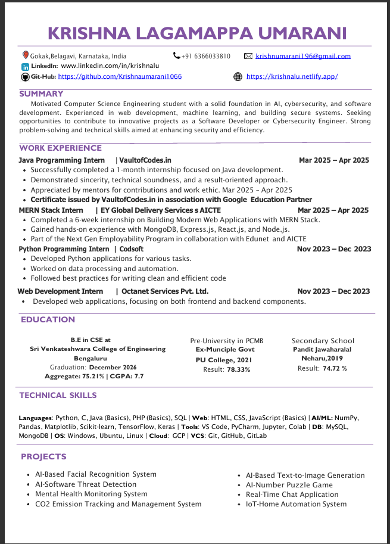

# 🌐 Personal Portfolio Website

Welcome to my personal portfolio website!  
This project showcases my skills, projects, resume, and contact details in a clean, responsive, and animated design.

---

## 🧑‍💻 About the Project

This portfolio is designed to reflect my passion for **web development, design, and creativity**.  
It includes modern animation effects, smooth transitions, and interactive UI components.

---

## 🚀 Features

- ✨ **Modern UI Design**
- 💻 **Responsive Layout** (works on all devices)
- ⚙️ **Dynamic Animations**
- 📄 **Downloadable Resume**
- 📸 **Profile & Project Images**
- 📬 **Contact Links** (Email, GitHub, Instagram, Threads)

---

## 🛠️ Tech Stack

- **HTML5**
- **CSS3**
- **JavaScript**
- **Font Awesome Icons**

---

## 📂 Project Structure
├── .idea/ # Project configuration files
├── icon.jpg # Profile icon
├── index.html # Main HTML file
├── resume-preview.jpg # Resume preview image
├── resume.pdf # Downloadable resume
├── sportsCar.jpg # About section image
├── style.css # CSS styles
└── Read.me # This file

---

## 📸 Preview

---

## 🔗 Live Demo

👉 [Visit Portfolio Website](https://krishnaumarani1066.github.io) *(Update this link after deployment)*

---

## 📫 Contact

- 📧 Email: [krishnaumrani196@gmail.com](mailto:krishnaumrani196@gmail.com)
- 🐙 GitHub: [@Krishnaumarani1066](https://github.com/Krishnaumarani1066)
- 📸 Instagram: [@krishna_l_u_555_7](https://www.instagram.com/krishna_l_u_555_7/)
- 🧵 Threads: [@krishna_l_u_555_7](https://www.instagram.com/krishna_l_u_555_7/)

---

## 🏁 Future Improvements

- Add backend contact form using Node.js or Firebase  
- Include project showcase cards with live demos  
- Integrate dark/light mode toggle  

---

⭐ *If you like this portfolio, consider giving it a star on GitHub!*

